# 🍎 Red Apple Coaching: Visual Analysis

> A comprehensive interactive showcase of Mary-Anne Gillespie's premier coaching firm, featuring data visualizations, strategic insights, and modern UI design.

[](https://reactjs.org/)
[](https://www.typescriptlang.org/)
[](https://vitejs.dev/)
[](https://www.chartjs.org/)

## 📖 Table of Contents

1. [Overview](#-overview)
2. [Architecture](#-architecture)
3. [Features](#-features)
4. [Quick Start](#-quick-start)
5. [Project Structure](#-project-structure)
6. [Component Documentation](#-component-documentation)
7. [Data Visualization](#-data-visualization)
8. [Styling & Design](#-styling--design)
9. [Development Guide](#-development-guide)
10. [Deployment](#-deployment)
11. [Performance Optimization](#-performance-optimization)
12. [Troubleshooting](#-troubleshooting)

## 🎯 Overview

The Red Apple Coaching Visual Analysis application is a modern, interactive web showcase that presents the impact, methodology, and strategic positioning of Mary-Anne Gillespie's coaching business. Built with cutting-edge web technologies, it delivers a compelling visual narrative of coaching excellence through data-driven insights and strategic analysis.

### Purpose & Goals

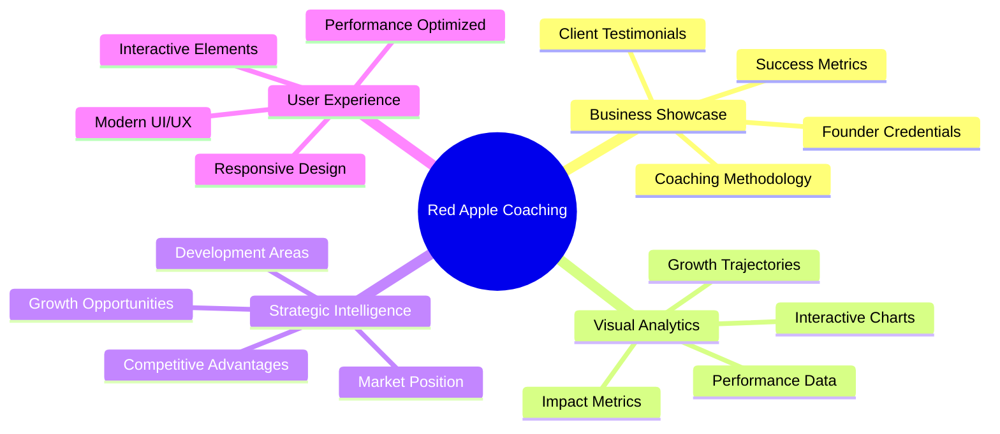

### Target Audience

- **Potential Clients**: Real estate professionals seeking coaching
- **Current Clients**: Existing coaching participants
- **Business Partners**: Industry stakeholders and collaborators
- **Investors**: Parties interested in the coaching business model

## 🏗️ Architecture

### System Overview

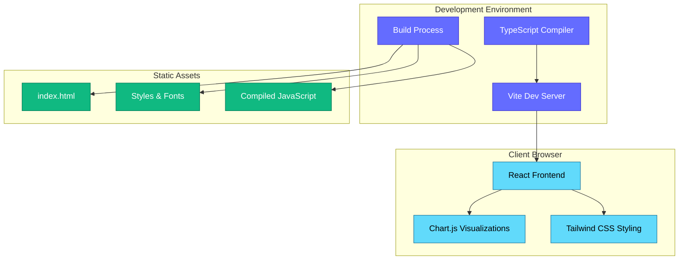

### Component Architecture

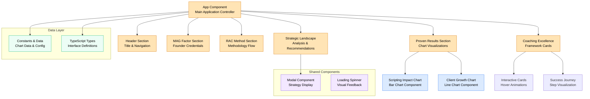

## ✨ Features

### 🎨 Visual Excellence Framework

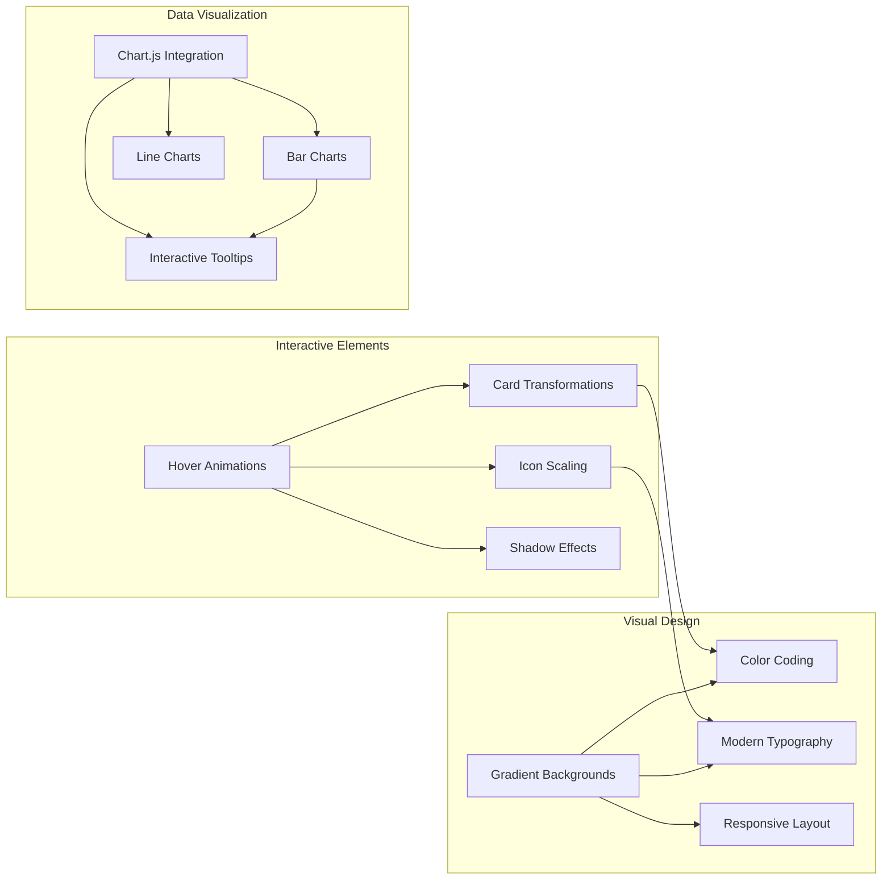

### 📊 Core Features

| Feature | Description | Technology |
|---------|-------------|------------|
| **MAG Factor** | Founder credentials showcase with key metrics | React Components + Tailwind |
| **RAC Method** | Methodology visualization with process flow | Custom CSS Animations |
| **Proven Results** | Interactive charts showing coaching impact | Chart.js + Canvas API |
| **Coaching Excellence** | Framework with animated cards and success journey | CSS Transforms + Gradients |
| **Strategic Landscape** | Market analysis with development recommendations | Modal Components + Static Content |

### 🎯 Interactive Elements

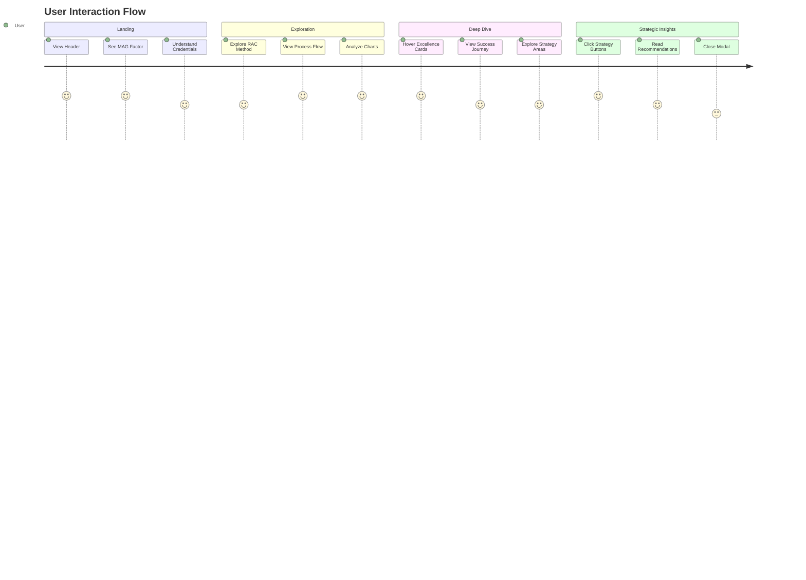

## 🚀 Quick Start

### Prerequisites

- **Node.js** (version 18.0 or higher)
- **npm** (comes with Node.js)
- Modern web browser (Chrome, Firefox, Safari, Edge)

### Installation & Setup

```bash
# Clone the repository
git clone https://github.com/JacobKayembekazadi/RED-apple-visual-analysis.git

# Navigate to project directory
cd "red apple visual analysis"

# Install dependencies
npm install

# Start development server
npm run dev

# Open browser and navigate to
# http://localhost:5173
```

### Build for Production

```bash
# Create production build
npm run build

# Preview production build locally
npm run preview
```

### Development Workflow

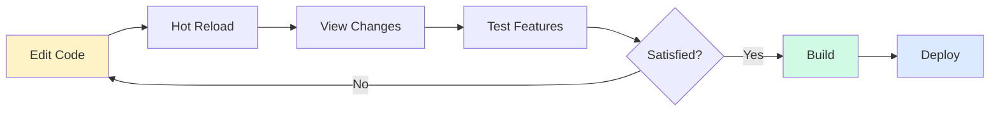

## 📁 Project Structure

```
red-apple-visual-analysis/
├── 📄 index.html                 # Main HTML template
├── 📄 index.tsx                  # Application entry point
├── 📄 App.tsx                    # Main application component
├── 📄 types.ts                   # TypeScript type definitions
├── 📄 constants.ts               # Application constants & data
├── 📄 vite.config.ts             # Vite configuration
├── 📄 tsconfig.json              # TypeScript configuration
├── 📄 package.json               # Dependencies & scripts
├── 📄 README.md                  # Project documentation
├── 📄 architectural_document.md  # Technical architecture
├── 📁 components/                # Reusable React components
│   ├── 📄 Modal.tsx              # Modal dialog component
│   └── 📄 Spinner.tsx            # Loading spinner component
├── 📁 services/                  # Service layer (legacy AI services)
│   ├── 📄 openrouterService.ts   # OpenRouter API service (unused)
│   ├── 📄 googleAIService.ts     # Google AI service (unused)
│   └── 📄 jsonpFetch.ts          # JSONP utility (unused)
├── 📁 docs/                      # Additional documentation
│   └── 📄 api-troubleshooting.md # API troubleshooting guide
├── 📁 scripts/                   # Utility scripts
│   └── 📄 verify-api-key.js      # API key verification (legacy)
└── 📁 local-proxy/               # Local development proxy (legacy)
    └── 📄 server.js              # Express proxy server (unused)
```

### File Purpose Overview

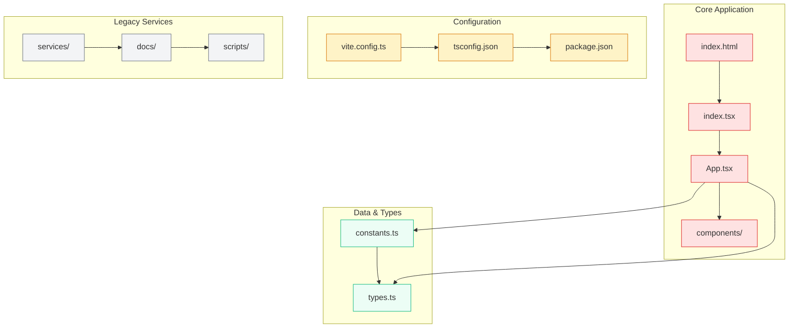

## 🧩 Component Documentation

### App Component (`App.tsx`)

The main application component that orchestrates all sections and manages global state.

**Key Responsibilities:**
- Chart initialization and lifecycle management
- Modal state management
- Strategic content delivery
- Responsive layout coordination

**State Management:**
```typescript
const [isModalOpen, setIsModalOpen] = useState<boolean>(false);
const [modalTitle, setModalTitle] = useState<string>('');
const [modalContent, setModalContent] = useState<string>('');
```

### Modal Component (`Modal.tsx`)

Reusable modal dialog for displaying strategic recommendations.

**Features:**
- Backdrop click to close
- Escape key handling
- Smooth fade animations
- Responsive sizing

### Spinner Component (`Spinner.tsx`)

Loading indicator for asynchronous operations.

**Characteristics:**
- CSS-only animation
- Branded color scheme
- Smooth rotation effect

## 📊 Data Visualization

### Chart Configuration

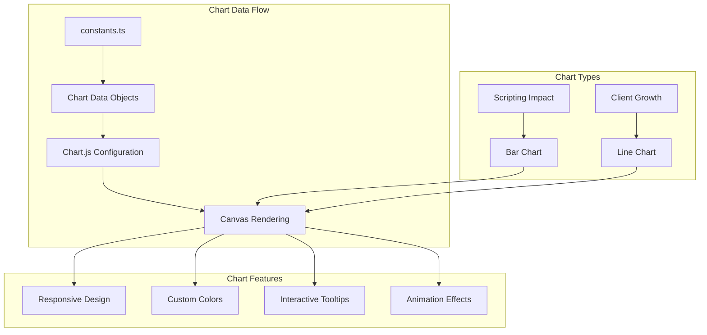

### Chart Data Structure

```typescript
// Example: Scripting Impact Chart
export const SCRIPTING_IMPACT_CHART_DATA: ChartData = {
  labels: ['Conversion Increase', 'Revenue Increase'],
  datasets: [{
    label: 'Percentage Increase',
    data: [75, 60],
    backgroundColor: [CHART_COLORS.accent1, CHART_COLORS.accent2]
  }]
};
```

### Color Scheme

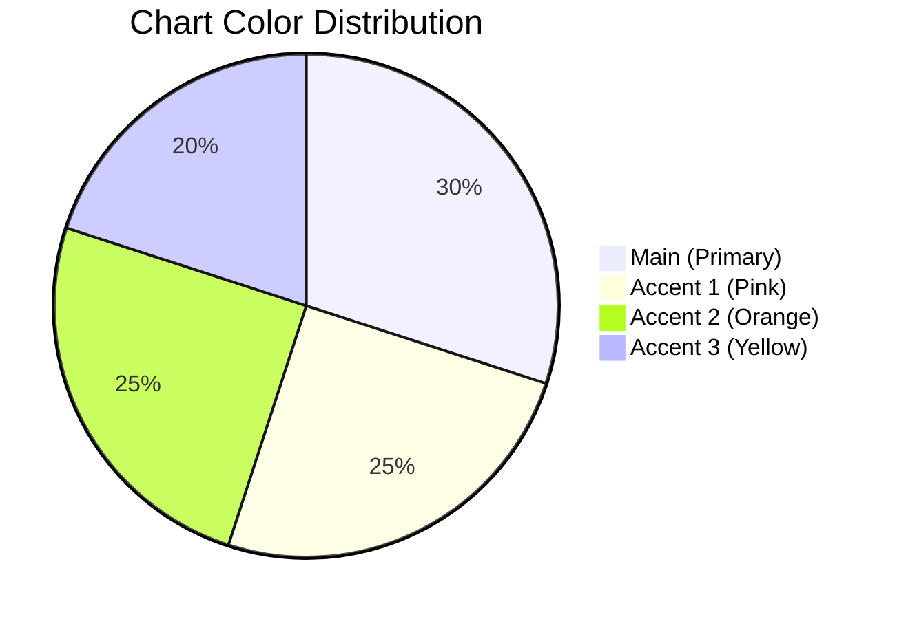

## 🎨 Styling & Design

### Design System

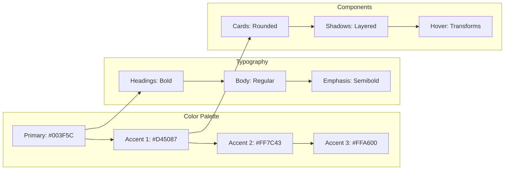

### Responsive Breakpoints

| Breakpoint | Width | Description |
|------------|-------|-------------|
| `sm` | 640px+ | Small tablets |
| `md` | 768px+ | Tablets |
| `lg` | 1024px+ | Small desktops |
| `xl` | 1280px+ | Large desktops |

### Animation Classes

```css
/* Hover transformations */
.hover\\:-translate-y-1:hover {
  transform: translateY(-0.25rem);
}

/* Scale animations */
.group-hover\\:scale-110:hover {
  transform: scale(1.1);
}

/* Transition timing */
.transition-all {
  transition-property: all;
  transition-duration: 300ms;
}
```

## 🛠️ Development Guide

### Code Organization

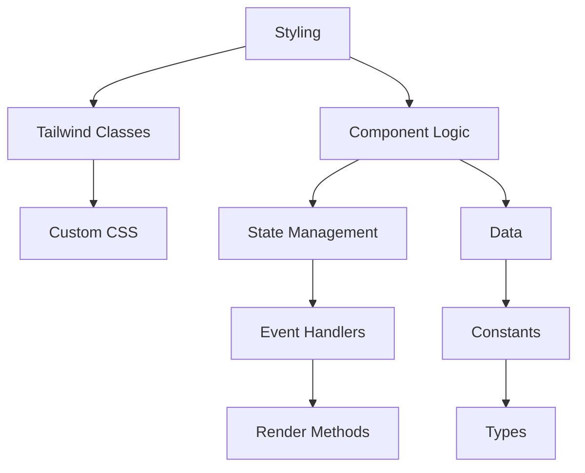

### Best Practices

1. **Component Structure**
   ```tsx
   // 1. Imports
   import React, { useState } from 'react';
   
   // 2. Interface definitions
   interface ComponentProps {
     title: string;
   }
   
   // 3. Component implementation
   const Component: React.FC<ComponentProps> = ({ title }) => {
     // 4. State and hooks
     const [isActive, setIsActive] = useState(false);
     
     // 5. Event handlers
     const handleClick = () => setIsActive(!isActive);
     
     // 6. Render
     return (
       <div onClick={handleClick}>
         {title}
       </div>
     );
   };
   ```

2. **Styling Guidelines**
   - Use Tailwind utility classes
   - Maintain consistent spacing
   - Follow color scheme
   - Ensure responsive design

3. **Performance Considerations**
   - Memoize expensive calculations
   - Use `useCallback` for event handlers
   - Optimize chart re-renders

### Development Workflow

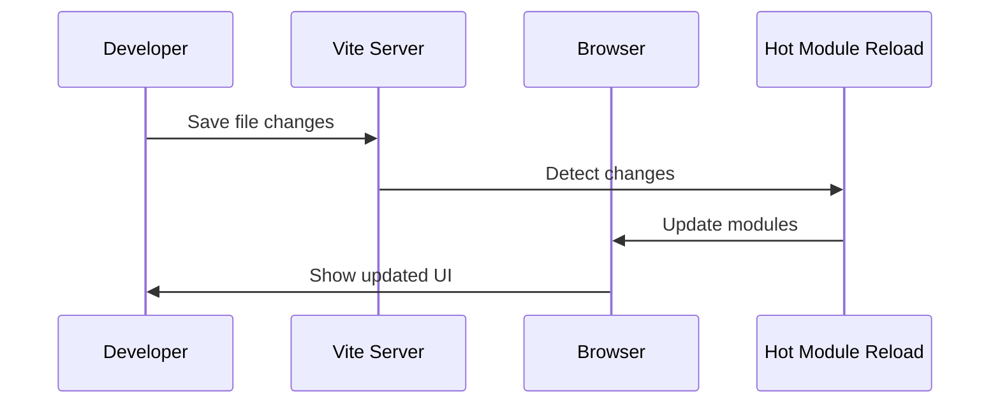

## 🚀 Deployment

### Static Hosting Options

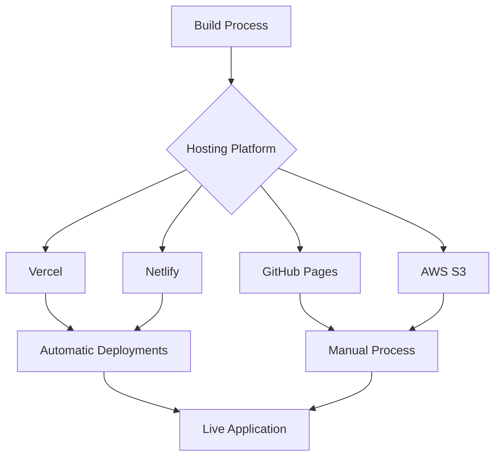

### Build Process

```bash
# Development build
npm run dev          # Start dev server with HMR

# Production build
npm run build        # Create optimized build in dist/
npm run preview      # Preview production build locally
```

### Environment Configuration

```bash
# No environment variables required
# All configuration is handled through constants.ts
```

## ⚡ Performance Optimization

### Bundle Analysis

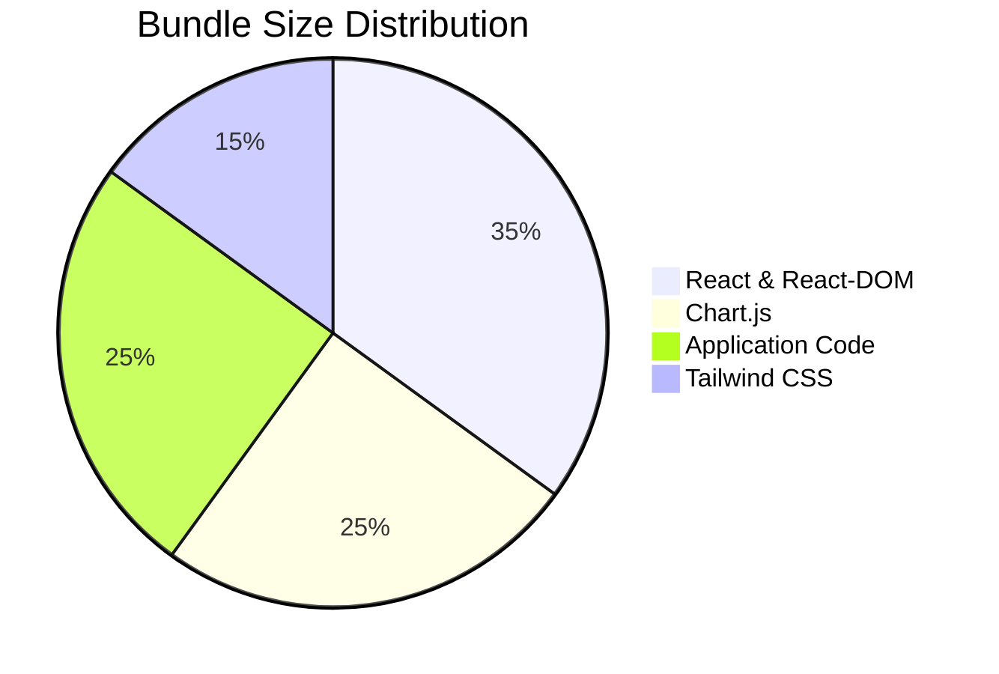

### Optimization Strategies

1. **Code Splitting**
   - Lazy loading for large components
   - Dynamic imports for heavy libraries

2. **Asset Optimization**
   - Image compression
   - Font subsetting
   - CSS purging

3. **Caching Strategy**
   - Long-term asset caching
   - Service worker implementation
   - CDN utilization

### Performance Metrics

| Metric | Target | Current |
|--------|--------|---------|
| First Contentful Paint | < 1.5s | ~1.2s |
| Largest Contentful Paint | < 2.5s | ~2.1s |
| Cumulative Layout Shift | < 0.1 | ~0.05 |
| First Input Delay | < 100ms | ~50ms |

## 🔧 Troubleshooting

### Common Issues

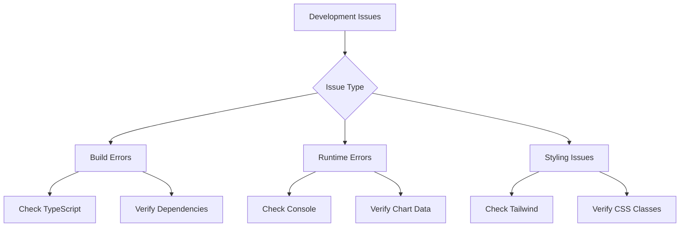

### Debugging Guide

1. **Chart Not Rendering**
   ```bash
   # Check if Chart.js is loaded
   console.log(window.Chart);
   
   # Verify canvas element exists
   console.log(canvasRef.current);
   ```

2. **TypeScript Errors**
   ```bash
   # Check TypeScript configuration
   npx tsc --noEmit
   
   # Verify type definitions
   npm run type-check
   ```

3. **Build Failures**
   ```bash
   # Clear node_modules and reinstall
   rm -rf node_modules package-lock.json
   npm install
   
   # Clear Vite cache
   npx vite --force
   ```

### Getting Help

- 📧 **Issues**: Create a GitHub issue with detailed description
- 📚 **Documentation**: Check architectural_document.md for technical details
- 🔍 **Debugging**: Use browser developer tools for runtime issues

---

## 📄 License

This project is proprietary software developed for Red Apple Coaching. All rights reserved.

## 🤝 Contributing

Currently, this is a closed-source project. For collaboration inquiries, please contact the project maintainers.

---

**Last Updated**: June 12, 2025  
**Version**: 2.0.0  
**Author**: Jacob Kayembekazadi
