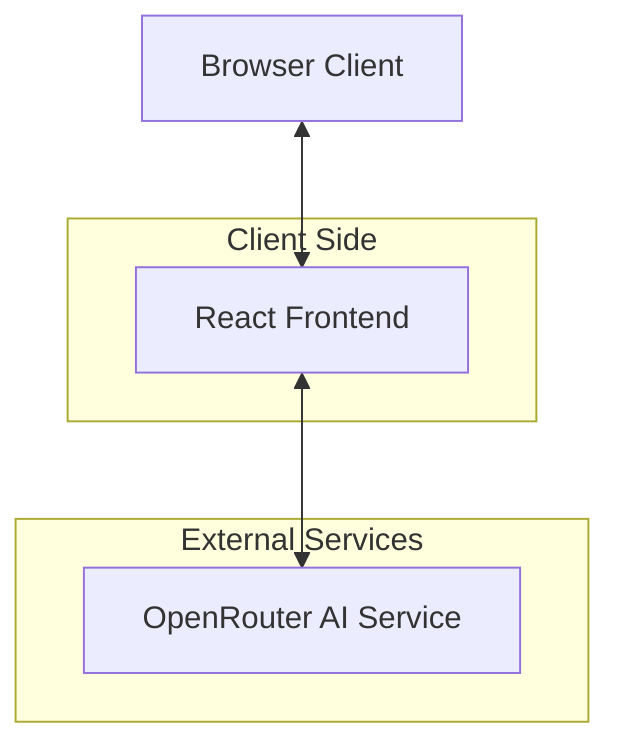
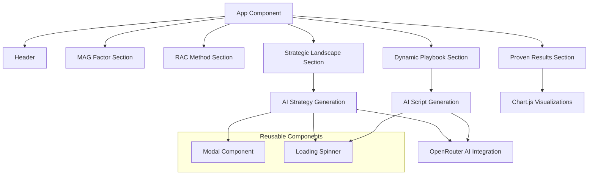
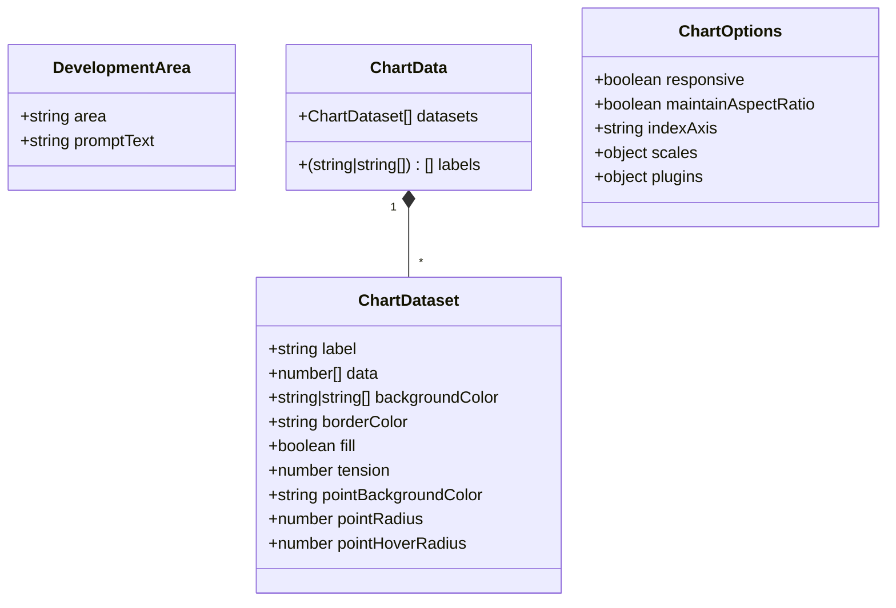
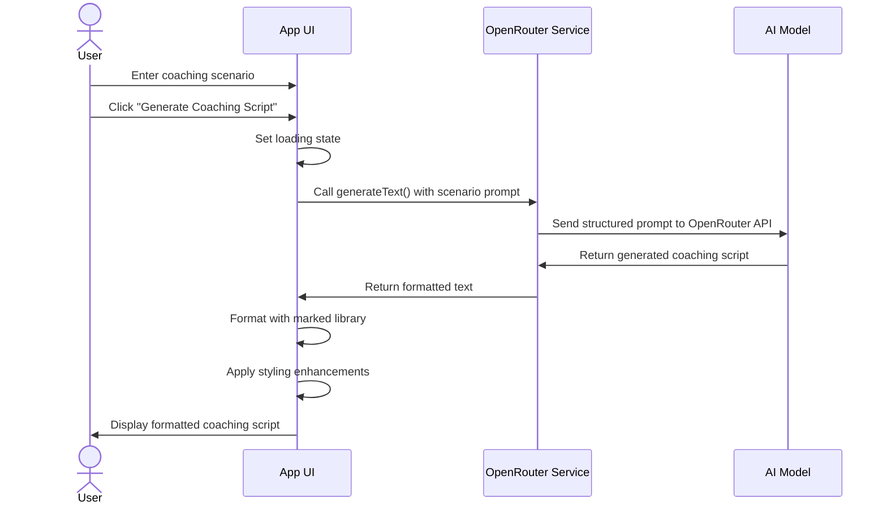
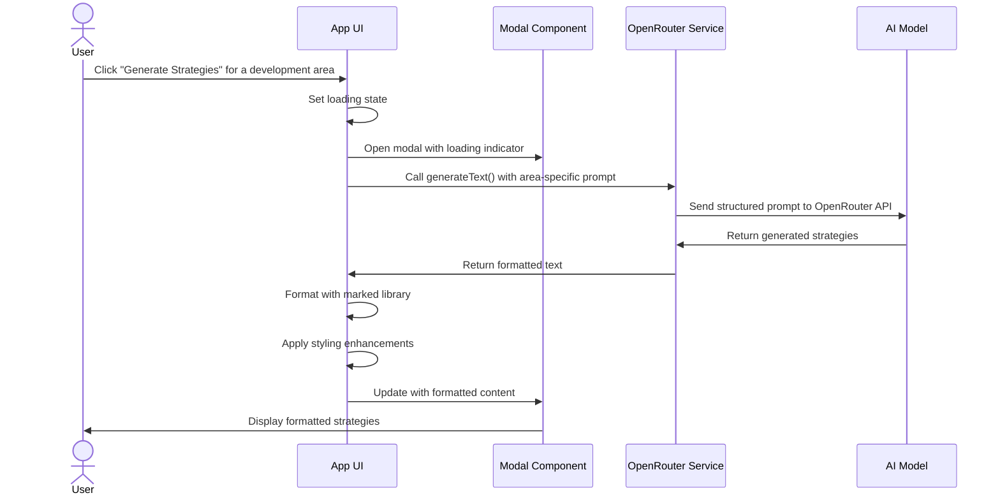
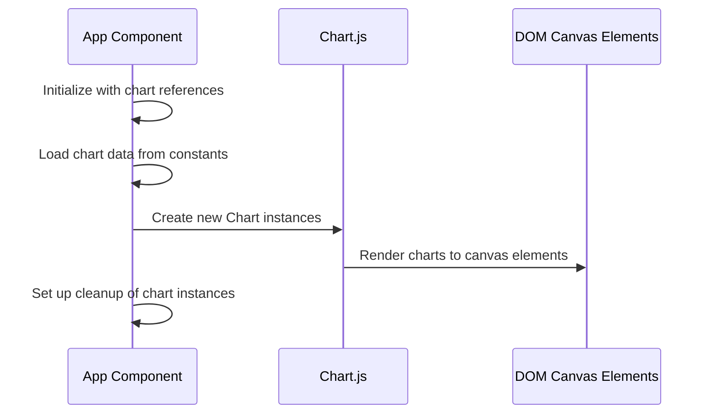
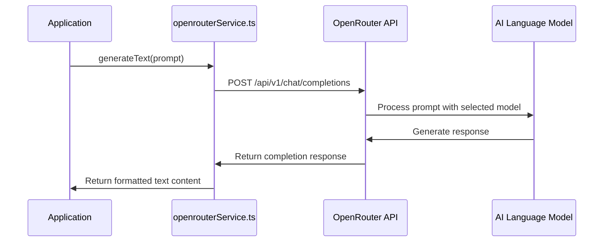
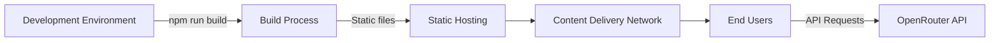

# Red Apple Coaching: AI Visual Analysis - Architectural Document

## Table of Contents
1. [Application Overview](#application-overview)
2. [System Architecture](#system-architecture)
3. [Component Breakdown](#component-breakdown)
4. [Data Models](#data-models)
5. [Core Workflows](#core-workflows)
6. [External Integrations](#external-integrations)
7. [Technology Stack](#technology-stack)
8. [Deployment Architecture](#deployment-architecture)
9. [Security Considerations](#security-considerations)

## Application Overview

The Red Apple Coaching: AI Visual Analysis is a single-page web application that serves as an interactive showcase for Mary-Anne Gillespie's coaching business. The application provides visual analysis of the coaching business's impact, methodology, and results while integrating AI capabilities to demonstrate dynamic coaching content generation.

**Primary Purpose:**
- Visualize the impact and methodology of Red Apple Coaching
- Demonstrate AI-powered coaching script generation based on user scenarios
- Generate strategic recommendations for business development areas
- Present key coaching metrics and results through interactive charts

**Target Users:**
- Potential coaching clients in the real estate industry
- Current Red Apple Coaching clients
- Business partners interested in Mary-Anne Gillespie's coaching methodology

## System Architecture

The application follows a client-side rendering architecture with AI service integration. It's built as a single-page application (SPA) with React and communicates with external AI services for content generation.

### High-Level Architecture Diagram

## Component Breakdown

### Frontend Components

### Main Components

1. **App.tsx**
   - Root component that orchestrates the entire application
   - Manages application state and UI layout

2. **Modal.tsx**
   - Reusable modal component for displaying generated strategy content
   - Handles open/close states and content rendering

3. **Spinner.tsx**
   - Loading indicator for async operations
   - Visual feedback during AI content generation

4. **Service Integrations**
   - openrouterService.ts: Handles communication with OpenRouter AI API

5. **Visual Sections**
   - MAG Factor: Showcases founder's credentials and impact
   - RAC Method: Visualizes the coaching methodology
   - Proven Results: Chart visualizations of coaching outcomes
   - Dynamic Playbook: AI-powered coaching script generation
   - Strategic Landscape: AI-powered strategic recommendations

## Data Models

### Core Data Interfaces

### Key Data Model Details

1. **DevelopmentArea**
   - `area`: String - The name of the development area
   - `promptText`: String - Description text for the development area

2. **ChartData**
   - `labels`: Array - Labels for chart data points
   - `datasets`: Array - Collection of datasets for the chart

3. **ChartDataset**
   - Configuration for visual presentation of chart data
   - Includes data points and styling options

4. **OpenRouterResponse** (Internal to service)
   - Handles the structured response from OpenRouter API

## Core Workflows

### 1. Dynamic Playbook Generation

### 2. Strategic Recommendations Generation

### 3. Charts Initialization and Rendering

## External Integrations

### OpenRouter AI Service

This application integrates with OpenRouter, a unified API gateway to various AI models, to provide AI-generated coaching content.

1. **Key Functionality**:
   - Generates coaching scripts based on user scenarios
   - Provides strategic recommendations for business development areas

2. **Integration Method**:
   - REST API with fetch calls
   - Authentication via API key
   - JSON request/response structure

3. **Configuration**:
   - API key managed via environment variables
   - OpenRouter model selection through constants

## Technology Stack

### Frontend
- **Framework**: React 19.1.0
- **Language**: TypeScript 5.7.2
- **Rendering**: Client-side rendering
- **UI Components**: Custom components with Tailwind CSS
- **Visualization**: Chart.js for data visualization
- **Markdown Processing**: marked 15.0.12

### Backend
- **None**: The application is purely frontend with external API integration

### External Services
- **AI Service**: OpenRouter API
- **AI Model**: deepseek/deepseek-r1-0528 (free tier)

### Development Tools
- **Build Tool**: Vite 6.2.0
- **Package Manager**: npm
- **Environment Management**: .env.local with Vite environment loading

## Deployment Architecture

The application is designed as a static single-page application that can be deployed to any static hosting service.

### Deployment Requirements
- Static file hosting capability
- Secure environment variable management for API keys
- CORS configuration for API access

## Security Considerations

1. **API Key Management**
   - OpenRouter API key stored in .env.local (not committed to source control)
   - Key is injected at build time by Vite
   - No client-side exposure of the raw API key

2. **Data Privacy**
   - User scenarios are sent to external AI service
   - No persistent storage of user inputs
   - No user authentication or personal data collection

3. **External Service Dependencies**
   - Application relies on OpenRouter API availability
   - Proper error handling for API failures is implemented

4. **Content Safety**
   - AI-generated content may need moderation
   - AI prompts are structured to guide appropriate responses
   - No content filtering is currently implemented

---

## Future Development Considerations

1. **Enhanced Features**
   - Saved coaching scripts feature
   - User authentication for personalized experiences
   - Export functionality for generated content

2. **Technical Improvements**
   - Server-side rendering option for improved SEO
   - Caching strategies for repeated AI requests
   - Content safety filters for AI-generated text

3. **Scalability**
   - API rate limiting management
   - Alternative AI model providers
   - Performance optimizations for larger datasets

---

*Document Version: 1.0*
*Last Updated: June 11, 2025*
